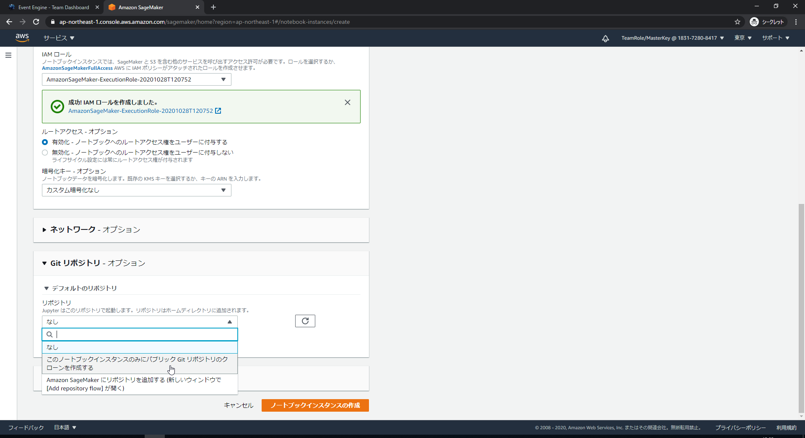
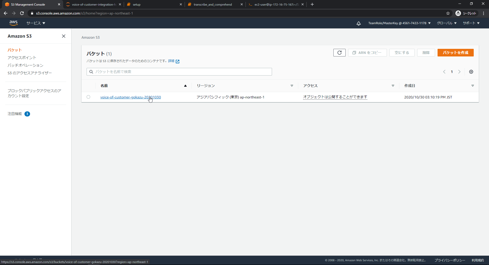
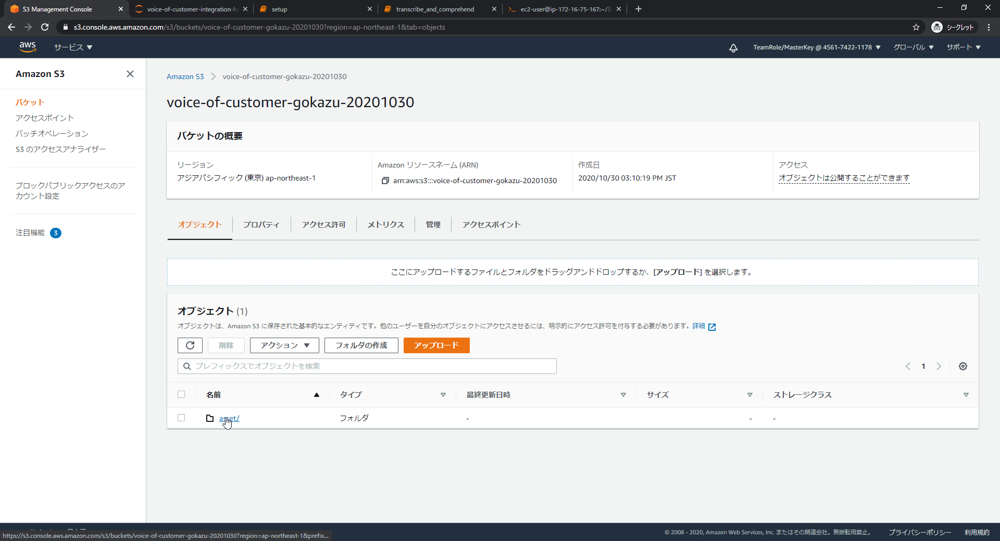
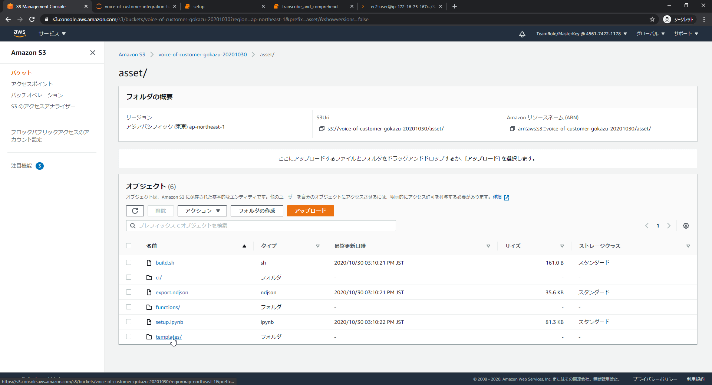
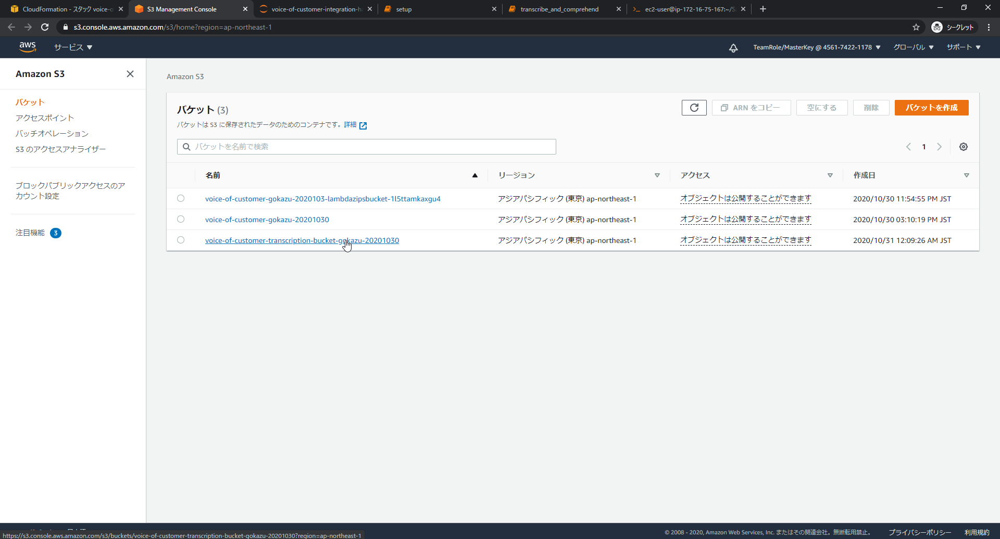
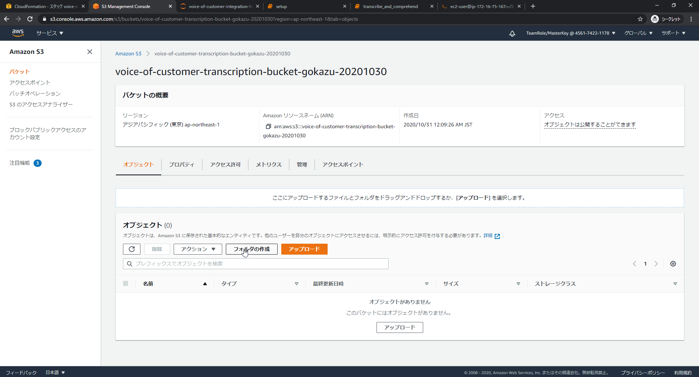
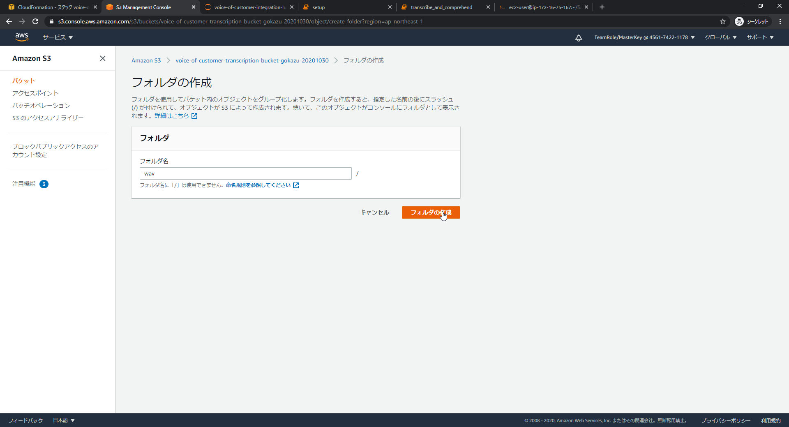
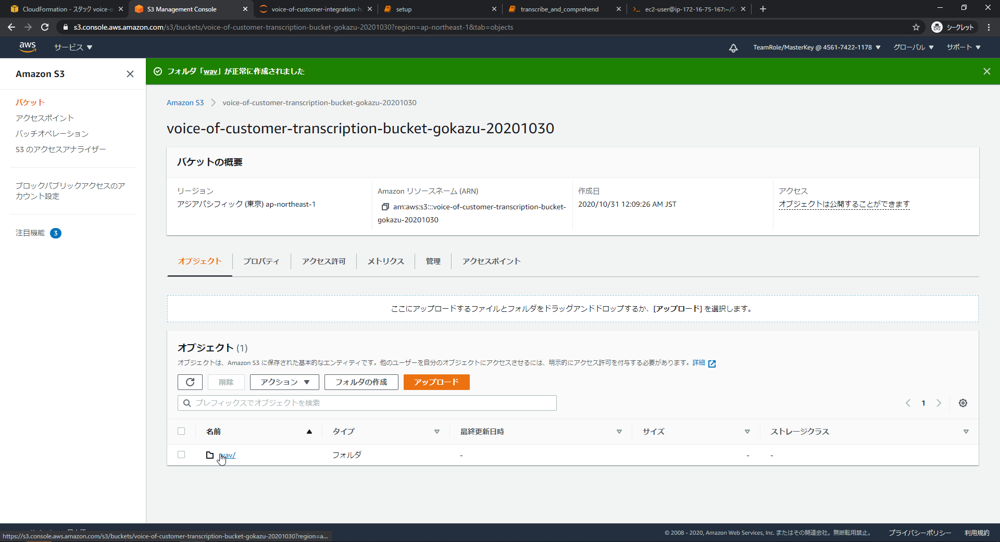
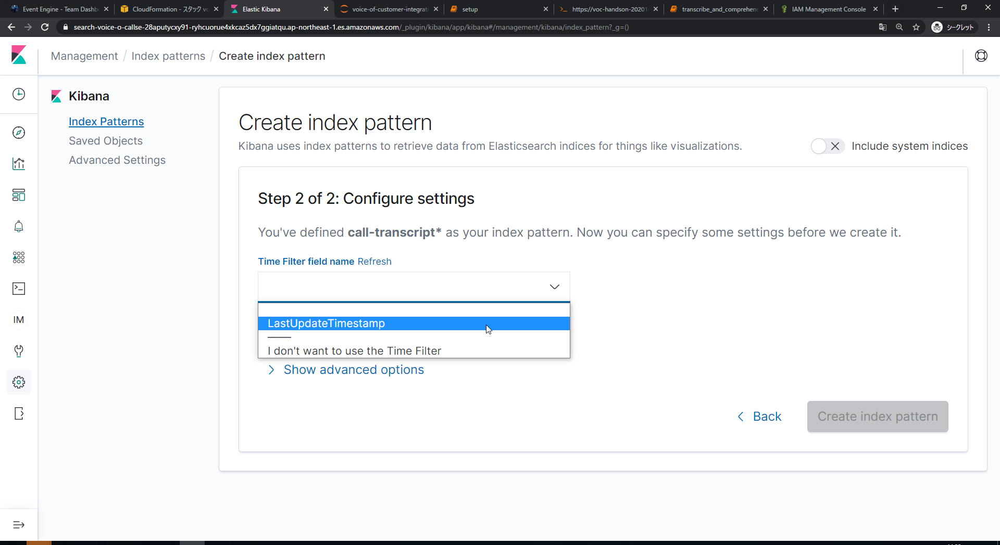

**本ハンズオン概要**

本ハンズオンはVoice of Customer Integration
ソリューションのハンズオンです。

最初にソリューションのコアのサービスである、Amazon Transcribe と Amazon
Comprehend のサービスを AWS SDK for Python boto3 を用いた API
経由で動かした後、AWS CloudFormation でVoice of Customer Integration
ソリューションをデプロイし、データを投入して分析結果の可視化を行います。

---

**全体の流れ**

1.  SageMaker Notebook インスタンスを作成（本ハンズオンの実行環境）

2.  Amazon Transcribe と Amazon Comprehend をboto3 を利用して実行する

3.  Voice of Customer Integration ソリューションをデプロイする

4.  Voice of Customer Integration
    ソリューションにデータを流し込んで利用してみる

---

1.  **SageMaker Notebook インスタンスを作成**

配布されたURLをブラウザ（Chrome/FireFox推奨）で開き、「Accept Terms &
Login」をクリックします。

「AWS Console」 をクリックします

「Open AWS Console」 をクリックします。（別タブでAWS
マネジメントコンソールが開かれます）

「サービスを検索する」のテキストボックスに 「SageMaker」 と打ち込み、
表示された 「Amazon SageMaker」 をクリックします。

左のペインにある「ノートブックインスタンス」をクリックします。

「ノートブックインスタンスの作成」をクリックします。

ノートブックインスタンス名に任意の名前を入力（例：VoC-handson-{yyyymmdd}-{name}など）します。また、IAMロールの部分にある「TeamRole」
と書かれたドロップダウンをクリックし、「新しいロールの作成」をクリックします。

ラジオボタンが表示されますので、「任意の S3
バケット」をクリックしてロールの作成をクリックします。

「Git
リポジトリ」をクリックし、「なし」になっているドロップダウンをクリックし、「このノートブックインスタンスのみにパブリック
Git リポジトリのクローンを作成する」をクリックします。

「Git リポジトリの URL」 というテキストボックスに、

<https://github.com/kazuhitogo/voice-of-customer-integration-handson>

と入力し、「ノートブックインスタンスの作成」をクリックします。

「ステータス」が「Penging」もしくは「In
Progress」になっていることを確認します。

ノートブックインスタンスからComprehend、Transcribe、S3の公開権限をつけるため、IAMロールを編集します。サービスからIAMを検索して、**新しいタブ**（またこのSageMakerの画面に戻ります）で開いてください。

左のペインから「ロール」をクリックしてください。

先程作成した、「Amazon
Sagemaker-ExecutionRole-YYYYMMDDTHHMMSS」のロールをクリックしてください。

「ポリシーをアタッチします」をクリックしてください。

検索テキストボックスに「Transcribe」と入力して、「AmazonTranscribeFullAccess」をチェック、「Comprehend」と入力して、ComprehendFullAccessをチェック、「S3」と入力して「AmazonS3FullAccess」をチェックして、「ポリシーのアタッチ」をクリックします。

Amazon
SageMakerの画面に戻り、「InService」になっていることを確認したら「Jupyter
を開く」をクリックします。

---

2. **Amazon Transcribe と Amazon Comprehend をboto3
    を利用して実行する**

「part1_use_service_on_cui」をクリックします。

「Transcribe_and_comprehend.ipynb」をクリックします。

（以降、ノートブックに記載に従っていください）

---

3. **Voice of Customer Integration ソリューションをデプロイする**

jupyter
のファイル一覧画面に戻り、「voice-ofcustomer-integration-handson」をクリックします。

「part2_solution」をクリックします。

「setup.ipynb」をクリックします。

2番目のセルにグローバルで一意なbucket名を入れます。

例：voice-of-customer-{name}-{yyyymmdd}など

「Cell」をクリックし、「Run All」をクリックします。

ファイル一覧画面に戻り、export.ndjsonにチェックを入れて、「Download」をクリックします。（手元のPCにexport.ndjsonがダウンロードされます）

AWSマネジメントコンソールでSageMakerを開いているタブに戻り、サービスから「S3」検索し、S3をクリックします。

先程入力したバケット名をクリックします。

例）voice-of-customer-{name}-{yyyymmdd}

「asset」→「template」→「quickstart-connect-voice-base-pipeline.yaml」の順にクリックします。

オブジェクト URL
をクリップボードにコピーします。（念の為テキストエディタ等にも貼り付けておいてください）

サービスのテキストボックスで「CloudFo」と入力し、「CloudFormation」をクリックします。

「スタックの作成」をクリックします。

Amazon S3 URLのテキストボックスに、先程コピーしたテキストを貼り付けます。

例：https://voice-of-customer-{name}-{yyyymmdd}.s3-ap-northeast-1.amazonaws.com/asset/templates/quickstart-connect-voci-base-pipeline.yaml

「次へ」をクリックします。

下記設定を入力し、「次へ」をクリックします。

-   スタックの名前：\
    任意の名前（例：voice-of-customer-{name}-{yyyymmdd}）

-   The name of the user that is used to log into kibana.:\
    kibana(デフォルト)

-   Audio transcription S3 Bucket Name:\
    グローバルで一意の名前を入力（例：voice-of-customer-transcription-bucket-{name}-{yyyymmdd}）

-   Quick Start S3 Bucket Name:\
    ノートブックで命名したBucket名（例：voice-of-customer-{name}-{yyyymmdd}）

-   Quick Start S3 Key Prefix:\
    asset/

下までスクロールして「次へ」をクリックします。

下までスクロールして、３つのチェックボックス全てにチェックを入れ、「スタックの作成」をクリックします。

左側のペインがCREATE_COMPLETEになるまで待ちます。

---

4. **Voice of Customer Integration
    ソリューションにデータを流し込んで利用してみる**

「S3」を検索して「S3」をクリックします。

CloudFormation のスタックを作成したときに指定した「Audio transcription
S3 Bucket Name」のBucket名をクリックします。

（例：voice-of-customer-transcription-bucket-{name}-{YYYYMMDD}）

「フォルダを作成」をクリックします。

テキストボックスに「wav」と入力して保存をクリックします。このフォルダに音声ファイルを入れます。

「wav」 をクリックします。

事前に配布した「sample.wav」を画面にドラッグ＆ドロップして「アップロード」をクリックします。（アップロードをトリガに音声ファイルの自動解析が始まります）

サービスから「CloudFormation」をクリックします。

先程作成したStack名を選択します。

（例：voice-of-customer-{name}-{yyyymmdd}）

「出力」をクリックします。

KibanaPassword欄にあるテキストをコピーし、KibanaUrlのリンクをクリックします。

Usernameにkibana,Password に先程コピーしたPasswordを入力して「Sign
in」をクリックします。

新パスワードを入力してSend
をクリックします。新パスワードはセキュリティ要件を満たす必要があります。

「Explorer on my own」をクリックします。

左端の下から２番目の「歯車アイコン」をクリックします。（Management）

「Saved Obejects」をクリックします。

「Import」をクリックします。

先程ダウンロードしたexport.ndjsonをドラッグ＆ドロップして、「Import」ボタンをクリックします。

「Done」をクリックします。

「Call Dashboard」をクリックします。

Index Pattern に「call-transcript\*」と入力して、「Next
step」をクリックします。

Time Filter field nameで LastUpdateTimeを選択し、「Create index
pattern」をクリックします。

「ゴミ箱マーク」 をクリックします。

「Delete」をクリックします。

左にある上から5つ目のアイコンの「Dashboard」をクリックします。

ダッシュボードが表示されました！（何も表示されない場合は右上のShow
datesの設定を変更してください。デフォルトの場合は15分前までにアップロードした音声ファイルの結果しか表示されません。）

データフィルタのインタラクションが設定されておりますのでお試しください。
